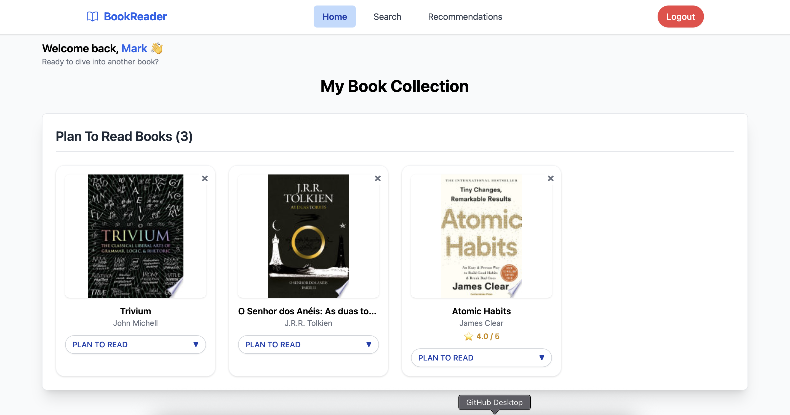

# 📚 Book Reader – Frontend


Book Reader is a modern web application built with React and TypeScript. It allows users to search books using the Google Books API, manage a personal collection, track their reading progress, and receive personalized recommendations.

---

## ✨ Features

- 🔍 **Book Search** – Search books by title and/or author using the Google Books API.
- 📚 **Personal Collection** – Add books to your collection with reading statuses: `PLAN_TO_READ`, `READING`, `PAUSED`, `DROPPED`, `READ`, and `RECOMMENDED`.
- 📖 **Book Details** – View extended book information including title, author(s), genre, ratings, and cover.
- 💡 **Recommendations** – Get suggestions based on book category.
- 🔐 **JWT Authentication** – All operations are protected via JWT.
- ⚡ **Responsive UI** – Fast interface built with TailwindCSS and React Query.
- 🔔 **Notifications** – Toast feedback on all user actions.

---

## 🧰 Tech Stack

- **React + TypeScript**
- **Vite**
- **React Router DOM**
- **React Query (TanStack)**
- **Zustand**
- **Tailwind CSS**
- **Heroicons**
- **React Toastify**

---

## 🖼️ Screenshots

Here’s how the app looks when books are added to your collection:



---

## 🚀 Getting Started

### 1. Clone the Repository

```bash
git clone https://github.com/Marco-Aguiar/zurich_frontend_project.git
cd zurich_frontend_project
```

### 2. Install dependencies
```bash
npm install
```

### 3. Configure Environment
Create a .env file in the root of the project:

```bash
REACT_APP_API_URL=http://localhost:8080
```


### 4. Run the application

```bash
npm start
```
Access the application at http://localhost:3000

---

### 🔐 Authentication
* Users must log in before performing any book operations.
* JWT is stored in localStorage and used automatically in authenticated requests.


---

### 🌱 Future Improvements

* 📊 Reading Tracker – Monitor your percentage read per book.
* 👥 Co-Reading – Connect with other users and view their collections.
* 📈 Stats Dashboard – See charts about your reading behavior over time.

---

### 🧪 Backend Integration

* This frontend connects directly to the Book Reader Backend via RESTful API.
* Make sure to clone and run the backend locally for full functionality.

---

### 🤝 Contributing
Contributions are welcome! Feel free to:<br>
*Fork the repository<br>
*Create a feature branch<br>
*Commit and push your code<br>
*Open a pull request
